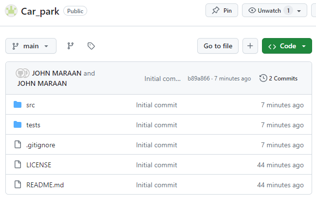
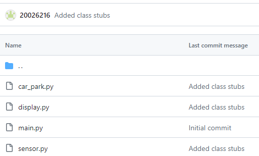
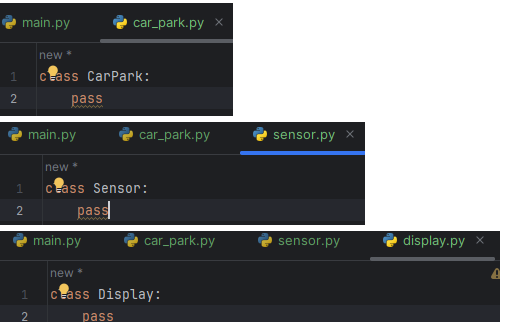
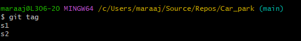
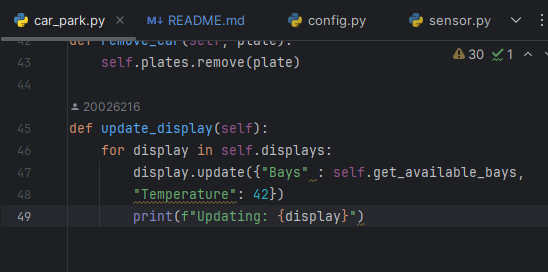
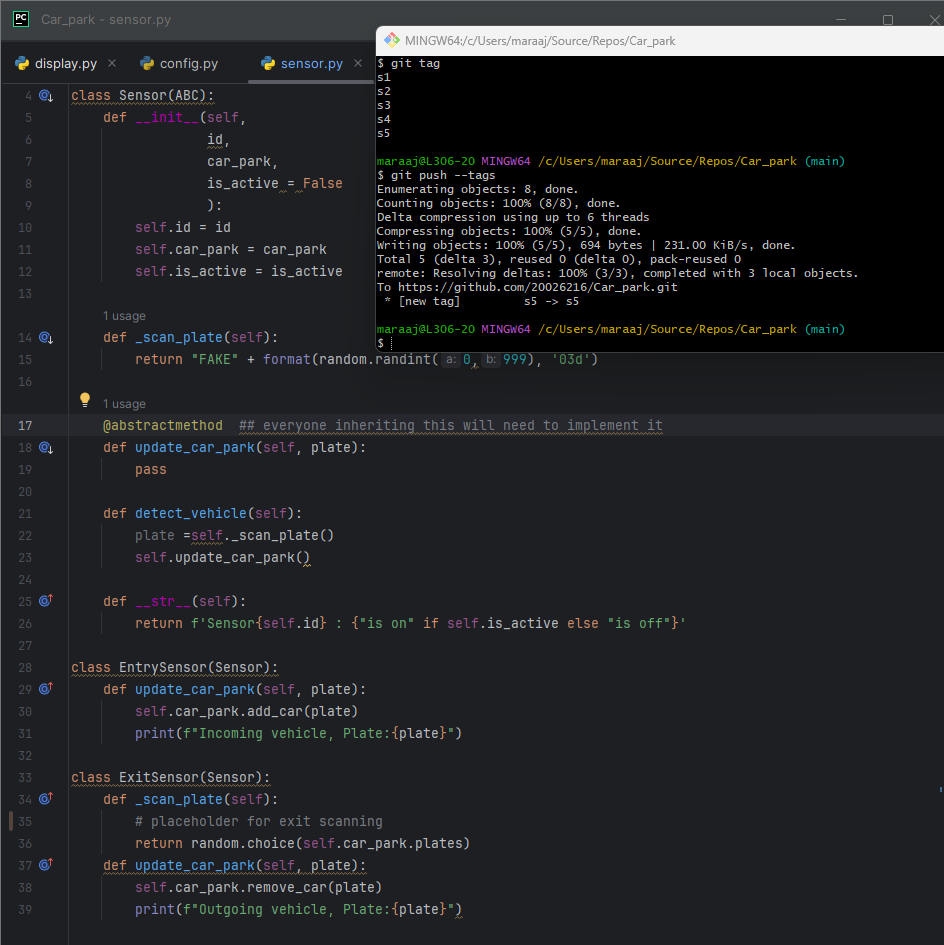

# Car_park

## initial commit:




## Added stubs




## Added constructors and attributes to classes




## Added methods 



## Review Questions

### Which class is responsible for each of the following pieces of information (and why)?
```
The number of available bays
- As the CarPark class has the method of get_available_bays, i think this class is
  responsible for the number of available bays, as this was marked as a property
  of this class, which makes it work as an attribute of the Carpark class.

The current temperature
- Even if the current implementation is hard coded into the Carpark class right now,
  the Sensor Class I think will be responsible for this in the end, as it doesn't 
  really make sense for the CarPark class to be solely responsible for this. When the
  sensor class is expanded upon, this will be inherited from the sensor class, into the
  classes that may need it (like the CarPark and Display).
  
The time
- The time class can be imported from the in built module of python, the time class itself
  could be imported from there. But in terms of what will be responsible for this mostly,
  the CarPark class could use this when updating the displays function is used.
  
What is the difference between an attribute and a property?
- An attribute is a variable that defines what a class is made out of. 
https://www.geeksforgeeks.org/accessing-attributes-methods-python/ 
- A property is a method that acts as an attribute.
  This is used for the get_available_bays, where it doesn't really work as a method
  by itself, or an attribute by itself. Making it a property allows for better
  identification of what it does (removes ambiguity).
```
### Why do you think we used a dictionary to hold the data we passed the display? List at least one advantage and one disadvantage of this approach.
```
- We used a dictionary as so you don't have to update the method everytime you want to,
  display a new set of values(eg. you want to implement weather forecasts into it, the
  approach we did makes it so you can just add it into the update_displays only, basically
  less things to update everytime you implement a new feature).
- A disadvantage would be since the dictionaries are mutable, this function can lead
  to unexpected changes when changing both methods.
  
```

## Added sensor detection

